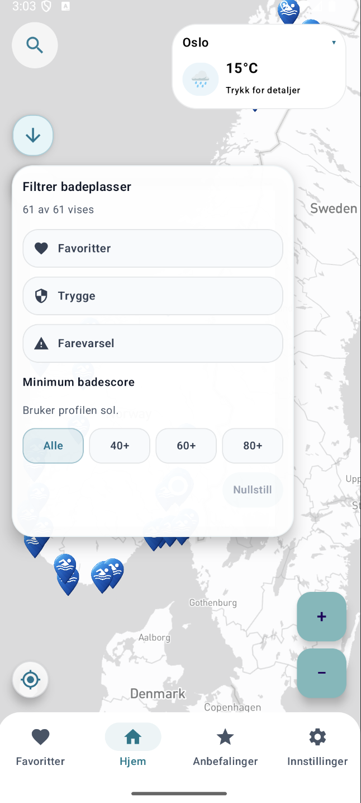
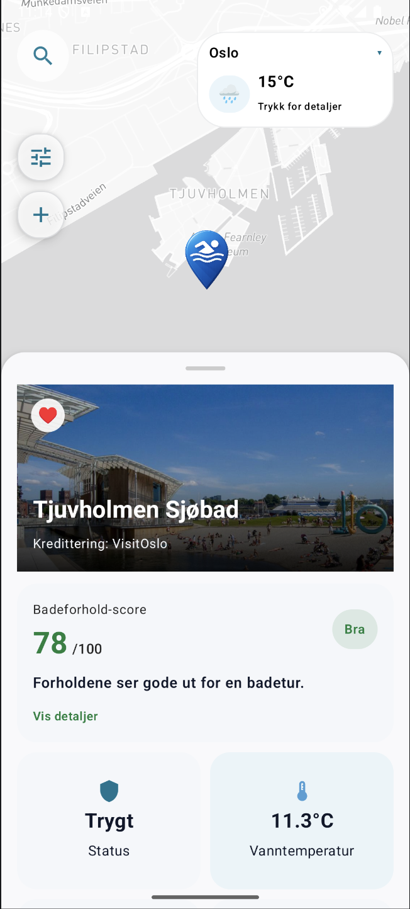
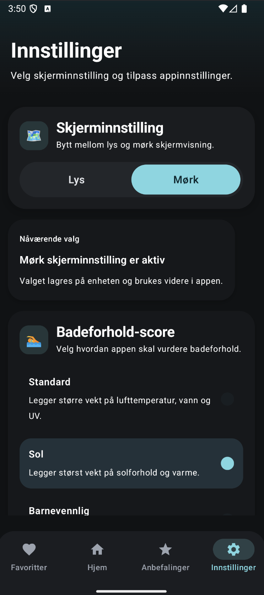
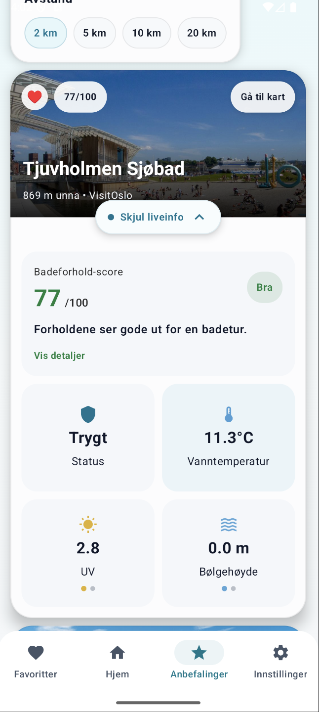
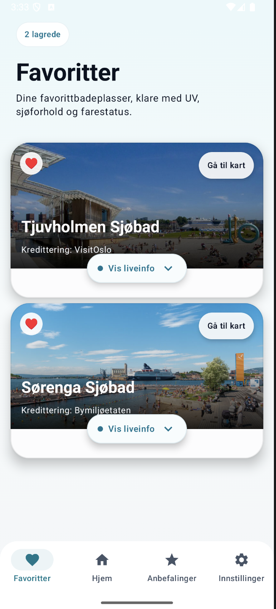
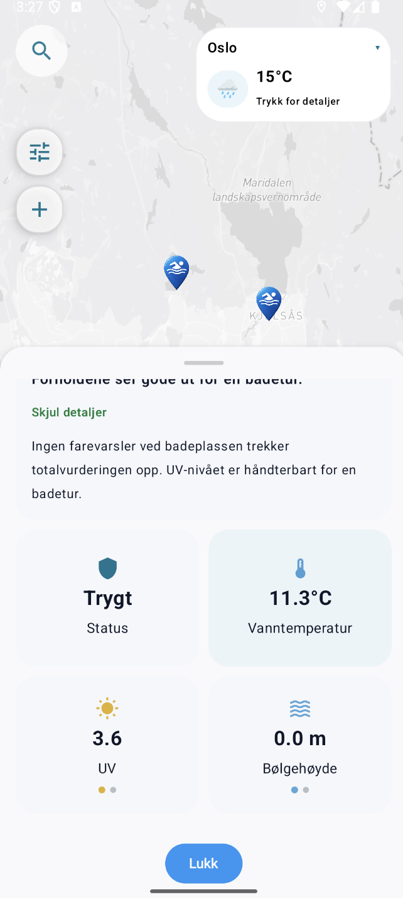

# Splæsh

<p align="center">
  
</p>

<p align="center">
  <b>An Android bathing app for Norway with interactive weather maps, point forecasts, warnings, sea data, UV, and smart beach recommendations.</b>
</p>

<p align="center">
  This repository is a public portfolio version of a team project originally developed in the course <code>IN2000</code>.
</p>

## Overview

Splæsh was built as a map-first app for people who want to find a good bathing spot quickly and understand both the weather and the safety conditions before going out.

The app combines:

- bathing places across Norway shown directly on a map
- weather point data and weather layers
- sea temperature, wave height, currents, and UV
- hazard warnings from Meteorologisk institutt
- a custom bathing score that summarizes local bathing conditions
- recommendations based on distance and bathing score

This makes the app useful both for spontaneous trips and for planning ahead.

## How the App Works

### 1. Map Overview and Point Weather

The home screen shows bathing places as pins on the map. Users can search, zoom, filter, and inspect places directly from the map view.  
The app also includes point-based weather data, so a user can tap on the map and inspect weather conditions for a chosen location.

<p align="center">
  
</p>

### 2. Beach Details and Bathing Score

When a user taps a bathing place pin, the app opens a detailed popup with the most relevant local information.  
This includes warnings, sea temperature, wave height, current, UV, and a custom bathing score that gives an overall evaluation of the conditions at that location.

<p align="center">
  
</p>

### 3. Weather Layers and Time-Based Forecasting

The app supports map layers for:

- temperature
- precipitation
- wind

These layers are shown directly on top of the map and can be explored together with a time scroller, giving the user a weather-map experience similar to a mini-Yr.  
This makes it possible to inspect forecast development over time rather than only looking at the current conditions.

<p align="center">
  
</p>

### 4. Recommendations and Favorites

The recommendation flow uses the user’s location and selected radius to suggest nearby bathing places.  
Places are ranked using distance and the app’s bathing score, helping the user quickly discover where the best nearby conditions are.

Users can also save favorite bathing places for faster access later.

<p align="center">
  
  
</p>

### 5. Settings and Accessibility

The app includes settings for display mode and bathing score preferences.  
It supports both light and dark screen settings and lets the user adjust how the score should weigh different conditions.

<p align="center">
  
</p>

## My Contributions

In this project, I contributed especially to:

- design and visual polish across the app
- hazard warnings API integration
- UV API integration
- work on the Victoria weather map integration
- bathing score UI and behavior
- recommendation features and UX
- preparing this public portfolio version of the repository

## Tech Stack

- `Kotlin`
- `Jetpack Compose`
- `MVVM`
- `Coroutines`
- `Retrofit`
- `OkHttp`
- `Gson`
- `Kotlinx Serialization`
- `Mapbox Maps SDK for Android`
- `Coil`
- `Google Play Services Location`

## APIs and Data Sources

- `Meteorologisk institutt - Locationforecast 2.0`
  Point-based forecast data such as temperature, wind, precipitation, and weather symbols.
- `Meteorologisk institutt - Oceanforecast 2.0`
  Sea temperature and wave-related data.
- `Meteorologisk institutt - MET Alerts`
  Hazard warnings used both in the map and in beach details.
- `Meteorologisk institutt - Victoria WMS`
  Weather map layers for temperature, precipitation, and wind.
- `Open-Meteo`
  UV index data used as additional outdoor comfort and safety information.

## Running the App Locally

### Requirements

- Android Studio
- Android SDK
- a physical Android device or emulator
- your own Mapbox tokens

### Clone the Repository

```bash
git clone https://github.com/arink1305/splaesh.git
```

### Local Setup

1. Open the project in Android Studio.
2. Copy `local.properties.example` to `local.properties`.
3. Add your own Mapbox values:

```properties
MAPBOX_ACCESS_TOKEN=your_public_mapbox_access_token
MAPBOX_DOWNLOADS_TOKEN=your_mapbox_downloads_token
```

4. Let Android Studio complete Gradle Sync.
5. Run the app on an emulator or a physical Android device.

### Why Mapbox Tokens Are Not Included

This public repository does not include live Mapbox values.

- `MAPBOX_ACCESS_TOKEN` is used by the app at runtime
- `MAPBOX_DOWNLOADS_TOKEN` is used by Gradle to fetch Mapbox dependencies

If you want people to test the app without setting up Android Studio, the best approach is to provide a built APK through GitHub `Releases`.

## Team Credit

Splæsh was originally developed as a team project in `IN2000` by Team 41.  
This repository is my public portfolio version of that work.
