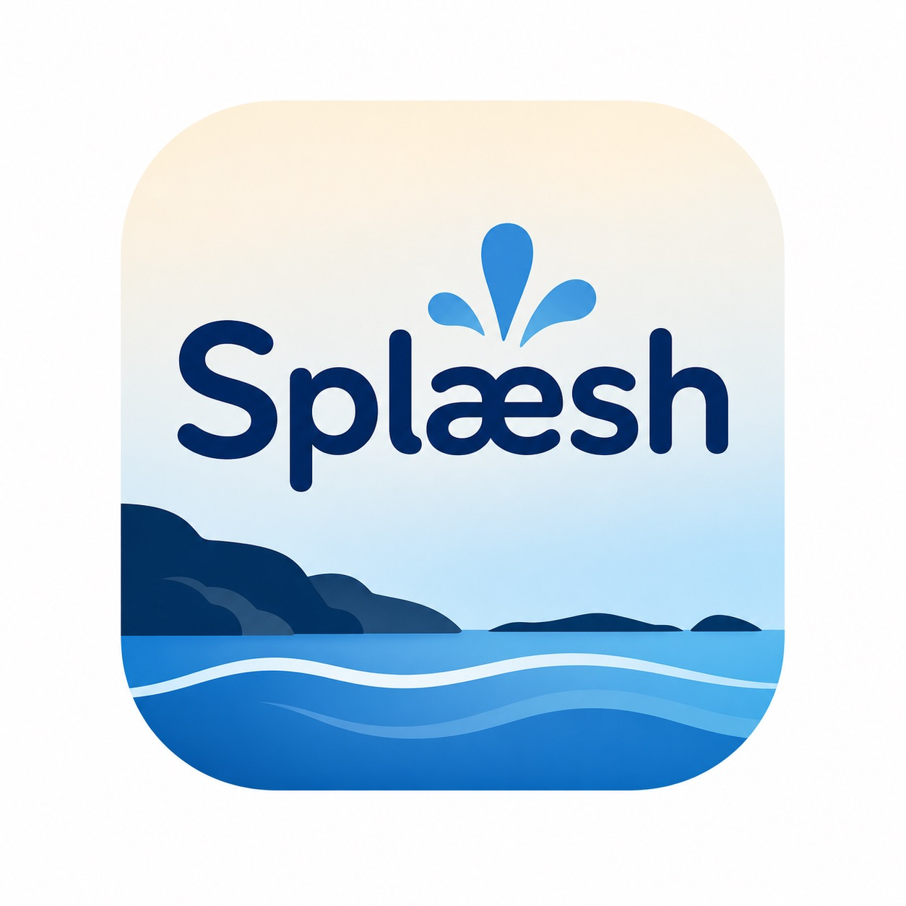

# Splæsh

<p align="center">
  
</p>

<p align="center">
  <b>An Android bathing app for Norway with interactive weather maps, point forecasts, sea data, hazard warnings, UV, and beach recommendations.</b>
</p>


## Project Context

Splæsh was built for the case <i>maps for the public</i>. The goal was to create a map-based app for a broad audience that makes it easy to find suitable bathing places and understand both comfort and safety conditions before going out.

The app is designed to help a user:

- find bathing places quickly on a map
- inspect local weather and sea conditions
- see hazard warnings directly in the map
- compare places using recommendations and a custom bathing score
- plan ahead with weather layers and forecasts up to 10 days

This repository is my public portfolio version of the project. It is meant to document the product, the technical choices, and the parts I contributed to in a team setting.

## What the App Does

Splæsh combines several kinds of information in one map-first Android app:

- bathing places across Norway
- point-based weather forecasts for selected locations
- weather map layers for temperature, precipitation, and wind
- sea temperature, wave height, and currents
- UV information
- hazard warnings as polygons and risk-aware pin styling
- personalized recommendations based on distance and bathing score
- favorites for quick access to saved places

The idea was not only to show where it is nice to swim, but also where it may be unsafe.

## Screenshots and Core Flows

### Map Overview and Point Forecasts

The home screen is centered around the map. Users can browse bathing places, search, zoom, filter, and tap directly in the map to inspect point-based weather data for a chosen location.

<p align="center">
  
</p>

### Beach Details and Bathing Score

Selecting a bathing place opens a detailed popup with the most relevant local information: weather, sea data, warnings, UV, and a custom bathing score that summarizes the overall bathing conditions.

<p align="center">
  
</p>

### Weather Layers and Time-Based Forecasting

The app includes weather layers from Victoria WMS for:

- temperature
- precipitation
- wind

These layers can be explored together with a time scroller, giving the user a mini weather-map experience for planning up to 10 days ahead.

<p align="center">
  
</p>

### Recommendations and Favorites

Recommendations use the user’s location and chosen radius to suggest nearby bathing places, ranked by distance and bathing score. Favorites make it easy to return to places the user likes or visits often.

<p align="center">
  
  
</p>

### Settings and Accessibility Choices

The app includes light and dark display settings, as well as score preferences that let the user change how the bathing score should weigh different conditions.

<p align="center">
  
</p>

## Main Features

- Interactive map with bathing place pins across Norway
- Point weather for chosen map locations
- Victoria WMS weather layers with time control
- Hazard warnings shown as polygons in the map
- Risk-based pin colors for affected bathing places
- Beach detail popup with weather, sea data, UV, and bathing score
- Recommendation flow based on distance and conditions
- Favorites system
- Light and dark display settings

## Architecture and Technical Approach

The app follows a typical Android architecture with a clear separation between UI, state handling, and data access:

- `Kotlin` and `Jetpack Compose` for the Android app and UI
- `MVVM` for screen state and presentation logic
- `Coroutines` for asynchronous work
- `Retrofit`, `OkHttp`, and `Gson` for external API calls
- `Kotlinx Serialization` for local JSON-based bathing place data
- `Mapbox Maps SDK for Android` for map rendering and interaction
- `Coil` for remote image loading
- `Google Play Services Location` for live user location

Bathing place data is stored locally in JSON in this project version, while live weather, sea, warning, and UV information comes from external APIs.

## APIs and Data Sources

### Meteorologisk institutt - Locationforecast 2.0

Used for point-based weather forecasts, including temperature, wind, precipitation, and weather symbols for selected locations.

### Meteorologisk institutt - Oceanforecast 2.0

Used for sea temperature and wave-related data. This was a better fit than station-based alternatives because the app needed sea data directly from coordinates tied to bathing places.

### Meteorologisk institutt - MET Alerts

Used for active hazard warnings. These warnings are shown both as polygons on the map and as part of the logic for coloring bathing place pins by risk level.

### Meteorologisk institutt - Victoria WMS

Used for weather map layers in the map client, especially temperature, precipitation, and wind over time.

### Open-Meteo

Used for live UV index and daily UV maximum values. It was chosen because it was straightforward to integrate and fit the app’s need for simple UV data.

## Testing and Quality Work

According to the project report, the app was tested through:

- manual testing
- user testing
- guerrilla testing
- unit testing of important parts such as favorites, location-related logic, and warning functionality

Because the app depends on multiple external APIs with different response times and data quality, robustness was an important part of the work. A central design goal was to keep the app useful even when some data was delayed or unavailable.

## My Role in the Project

This was a team project, so I do not claim sole authorship of the entire app. My main contributions were:

- design and visual polish across the app
- hazard warnings API integration
- UV API integration
- work on the Victoria weather map integration
- bathing score UI and behavior
- recommendation features and UX
- preparing this public portfolio version of the repository

## What I Learned

This project gave me practical experience with:

- building a map-first Android app for a broad public audience
- integrating several external APIs with different formats, latency, and stability
- turning complex data, such as warning polygons and weather layers, into understandable UI
- balancing usability, design clarity, and information density
- working in a cross-disciplinary team with agile practices, user feedback, and shared ownership

One of the most valuable lessons was seeing how much better the product became when technical implementation and user testing informed each other continuously.

## Running the App Locally

### Requirements

- Android Studio
- Android SDK
- a physical Android device or emulator
- your own Mapbox tokens

### Clone the Repository

```bash
git clone https://github.com/arink1305/splaesh.git
```

### Local Setup

1. Open the project in Android Studio.
2. Copy `local.properties.example` to `local.properties`.
3. Add your own Mapbox values:

```properties
MAPBOX_ACCESS_TOKEN=your_public_mapbox_access_token
MAPBOX_DOWNLOADS_TOKEN=your_mapbox_downloads_token
```

4. Let Android Studio complete Gradle Sync.
5. Run the app on an emulator or a physical Android device.

### Why Mapbox Tokens Are Not Included

This public repository does not include live Mapbox values.

- `MAPBOX_ACCESS_TOKEN` is used by the app at runtime
- `MAPBOX_DOWNLOADS_TOKEN` is used by Gradle to fetch Mapbox dependencies

## Project Status

This repository is a public portfolio version of the original course project.

- It is intended to showcase the product and my contributions.
- It is not presented as a solo project.
- No production release or public APK is bundled in this repository at the moment.

## Team Credit

This portfolio repository highlights my involvement in that work while keeping the project context clear.
